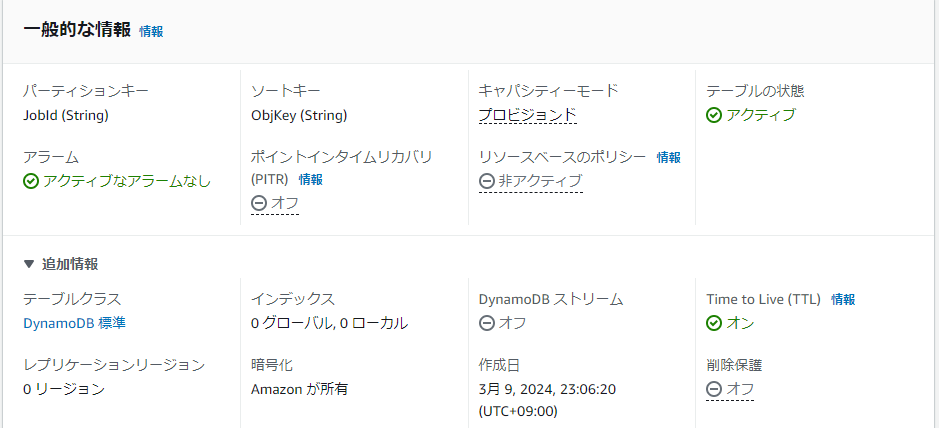
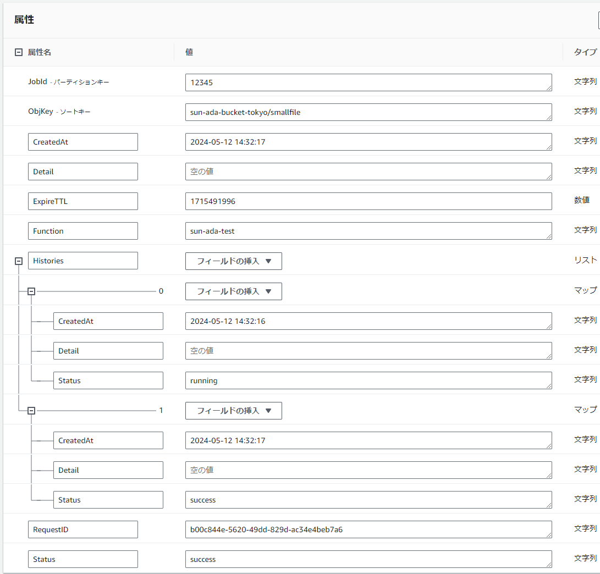
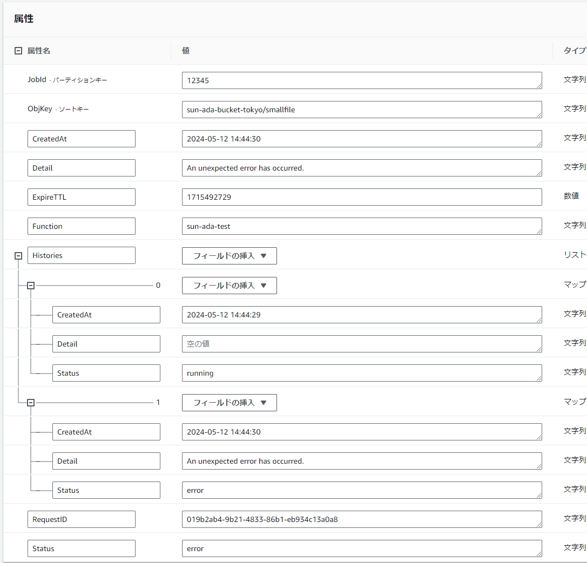

# lambda-idempotency
AWS Lambda sample code for implementing idempotency.

## 説明

残念ながらAWS Lambdaでは発火イベントが意図せず複数回発生してしまうことがあります。

[【AWS Black Belt Online Seminar】Serverless モニタリング 【P.48】から抜粋](https://pages.awscloud.com/rs/112-TZM-766/images/20190820_AWS-Blackbelt_Serverless_Monitoring.pdf#page=48)


その結果、処理中／処理済データを処理しようとして次のような問題が発生してしまいます。

* 処理対象データが巨大な場合、ハイスペックで高単価なLambdaが無駄に複数回実行されコストが嵩む
* 処理中データを複数処理で取り合いデータの破損やデッドロックや待ちが発生する
* 後発処理がエラーとなり処理の実行メトリクスが悪化する
* 後発処理がエラーとなり無駄にアラートの発報が発生する
* 絶対に失敗する後発処理エラーに対して無駄なLambdaのリトライが発生する（初期設定では2回）

以上の問題を防ぐAWS Lambdaの実行の冪等性（べきとうせい）を実現するサンプルを実装しました。

以下のバージョンを利用しました。

* python_version :  3.8.18
* boto3.version :  1.26.90

冪等性を実現するためのデータストアはDynamoDBでテーブル定義は以下のとおりです。



## TTL（Time to Live）

DynamoDBテーブルのイベントデータはTTL設定により一定時間経過後に自動削除されます。


但し、TTL設定によるデータ削除のタイミングは、それほど厳密ではないことに注意してください。古いAWSドキュメントには「最大48時間」という記載があったようですが現在はありません。[AWS re:Post に記載された新しい情報](https://repost.aws/ja/knowledge-center/dynamodb-expired-ttl-not-deleted)では「通常、期限切れの項目を数日以内に削除します」と記載されています。今回の試行では平均10分強程で削除されていました。（※参考値）

## テストデータ

テスト実行に用いたイベントデータは次のとおりです。

```
{
  "JobId": "12345",
  "ObjKey": "sun-ada-bucket-tokyo/smallfile"
}
```

### 正常終了

DynamoDBテーブルに以下のように記録されます。



### 異常終了

DynamoDBテーブルに以下のように記録されます。



### 多重起動

ログに以下のように出力して直ちに処理を終了します。

#### Function Logs

```
START RequestId: 50d363b4-b6ab-48d2-843d-aab3a0043aec Version: $LATEST
：
[WARNING]	2024-03-10T02:36:47.423Z	50d363b4-b6ab-48d2-843d-aab3a0043aec	lambdaが多重起動したため処理を終了しました。
：
END RequestId: 50d363b4-b6ab-48d2-843d-aab3a0043aec
```

## 参考

### 冪等性

* https://pages.awscloud.com/rs/112-TZM-766/images/20190820_AWS-Blackbelt_Serverless_Monitoring.pdf
* https://docs.aws.amazon.com/ja_jp/lambda/latest/dg/best-practices.html
* https://repost.aws/ja/knowledge-center/lambda-function-idempotent
* https://aws.amazon.com/jp/builders-flash/202107/serverless-idempotency-implementation-2/
* https://www.sunnycloud.jp/column/20221110/
* https://it-ouji.com/2021/10/24/aws-dynamodb%E3%82%92%E4%BD%BF%E7%94%A8%E3%81%97%E3%81%A6lambda%E3%81%AE%E5%86%AA%E7%AD%89%E6%80%A7%E3%82%92%E5%AE%9F%E8%A3%85%E3%81%99%E3%82%8B/
* https://zenn.dev/enven/articles/041ab29a69b3ce

### TTL

* https://docs.aws.amazon.com/ja_jp/amazondynamodb/latest/developerguide/time-to-live-ttl-how-to.html
* https://docs.aws.amazon.com/ja_jp/amazondynamodb/latest/developerguide/TTL.html
* https://repost.aws/ja/knowledge-center/dynamodb-expired-ttl-not-deleted
* https://note.com/taro1212/n/n03b60ed03304
